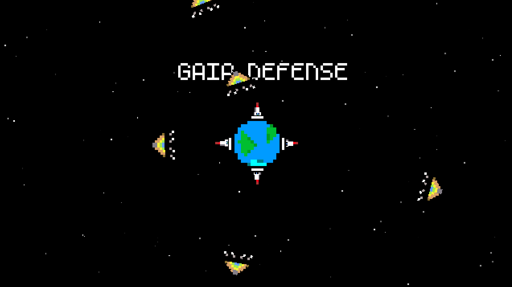
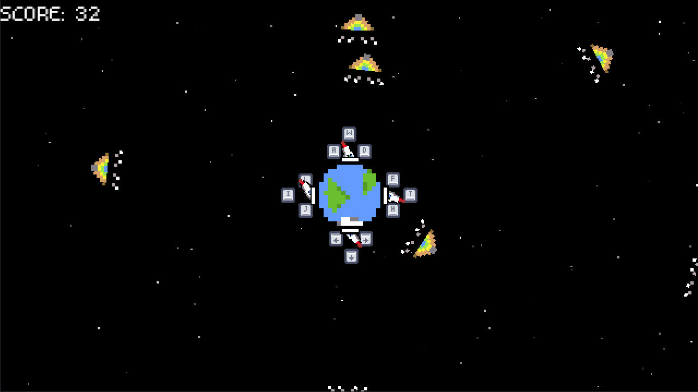

# Gaia Defense (Earth Defense Protocol)


> **Protect the Core.** A chaotic, multi-directional arcade shooter made with Godot 4.

[](https://estairs.itch.io/gaia-defense)
[](https://godotengine.org/)

## 🌍 About the Game

**Gaia Defense** is a fast-paced arcade game where you are the last line of defense against the **PyramAlien** invasion. 

Starting with a single turret, you must survive endless waves of geometric enemies descending from space. As you prove your worth (and increase your score), you unlock new defensive capabilities, eventually managing a full 360-degree warzone.

This project was developed to explore **Godot 4**, focusing on scalable difficulty, state management, and juice/game feel (screen shake, particles, dynamic audio).

## ✨ Features

* **Multi-Directional Combat:** Manage up to 4 turrets simultaneously (Top, Bottom, Left, Right).
* **Dynamic Progression:** Turrets unlock automatically as you reach score milestones.
* **Arcade Aesthetics:** Retro pixel art, CRT vibes, and particle-heavy explosions.
* **Reactive Audio:** Sound effects with pitch randomization for a dynamic auditory experience.
* **High Score System:** Challenge yourself to beat your personal best.

## 🎮 Controls

The game tests your multitasking skills. Each turret has its own control scheme:

| Turret | Shoot | Rotate Left/Right |
| :--- | :---: | :---: |
| **Top** | `W` | `A` / `D` |
| **Bottom** | `⭣` | `←` / `→` | `Space` | `V` | `B` |
|**Left** | `T` | `F` / `H` |
| **Right** | `I` | `J` / `L` |

* **Restart:** `Enter` (on Game Over screen)

## 📸 Screenshots

<div align="center">
  
  
</div>
## 🛠️ Built With

* **Engine:** [Godot 4](https://godotengine.org/)
* **Language:** GDScript
* **SFX:** Generated with [Bfxr](https://www.bfxr.net/)
* **Assets:** Custom Pixel Art & [Kenney Assets](https://kenney.nl/) (Input Prompts)

## 🚀 How to Run the Project

If you want to check the source code or modify the game:

1.  **Clone the repository:**
    ```bash
    git clone [https://github.com/primokog/gaiadefense.git](https://github.com/primokog/gaiadefense.git)
    ```
2.  **Import into Godot:**
    * Open Godot Engine 4.x.
    * Click **Import**.
    * Navigate to the cloned folder and select the `project.godot` file.
3.  **Run:**
    * Press `F5` to play the main scene.